# supabase.sh

> Supabase docs over SSH — powered by [bashkit](https://github.com/everruns/bashkit)



Give your agents shell access to Supabase documentation:

```bash
ssh supabase.sh <grep/cat/etc> /supabase/docs/...
```

Docs are up-to-date and served as markdown files so agents can explore them the same way they explore code.

## Setup

Tell your agent to check the Supabase docs before implementing features or fixing bugs:

```bash
ssh supabase.sh agents >> AGENTS.md # or CLAUDE.md, GEMINI.md, etc
```

This outputs a lightweight markdown snippet and appends it to the end of your `AGENTS.md` file. The snippet tells your agent to check the docs before working with Supabase, keeping it grounded in current docs and less likely to hallucinate.

## Why SSH?

Coding agents spend a lot of time in the shell. When exploring a codebase, they tend to reach for the same handful of tools: grep, find, ls, cat. These models are trained heavily on shell usage, so they treat the file system as a first-class interface. supabase.sh gives them that same interface for Supabase docs.

Traditional search interfaces (FTS, vector search) work too, but they're more opaque — the agent asks a question and gets back results without the ability to explore or navigate. With SSH, it can grep across docs, cat specific files, and use head and tail to skim without bloating its context window — the same way it would with any codebase.

## How does it work?

Under the hood, commands run inside [**bashkit**](https://github.com/everruns/bashkit) — a fast virtual bash interpreter written in Rust. bashkit reimplements 150+ Unix commands (grep, find, sed, awk, jq, …) with no fork/exec and no access to the host: everything runs in-process against a sandboxed virtual filesystem where the Supabase docs are mounted read-only as markdown files.

When your agent runs a command over SSH, the server spins up a fresh bashkit sandbox, executes the command inside it, and streams the output back — without ever touching a real shell or the host filesystem.

- **SSH transport**: [russh](https://github.com/Eugeny/russh)
- **Sandbox**: [bashkit](https://github.com/everruns/bashkit) (`realfs` read-only mount, execution/memory/session limits)
- **Server code**: [`crates/supabase-ssh`](./crates/supabase-ssh) — see its [README](./crates/supabase-ssh/README.md) to build, configure, and run it yourself

## Running it yourself

```bash
cd crates/supabase-ssh
DOCS_DIR=/path/to/docs PORT=2222 cargo run --release
# then: ssh -p 2222 localhost 'grep -rl auth /supabase/docs/'
```

Full configuration (ports, timeouts, connection limits, host keys) and the test suite are documented in the [crate README](./crates/supabase-ssh/README.md).

## Related

This is the Rust/bashkit implementation. The original TypeScript version — built on Vercel's [just-bash](https://github.com/vercel-labs/just-bash) — lives at [**supabase-community/supabase-ssh**](https://github.com/supabase-community/supabase-ssh).

## License

Apache 2.0. See [LICENSE](./LICENSE) for details.
